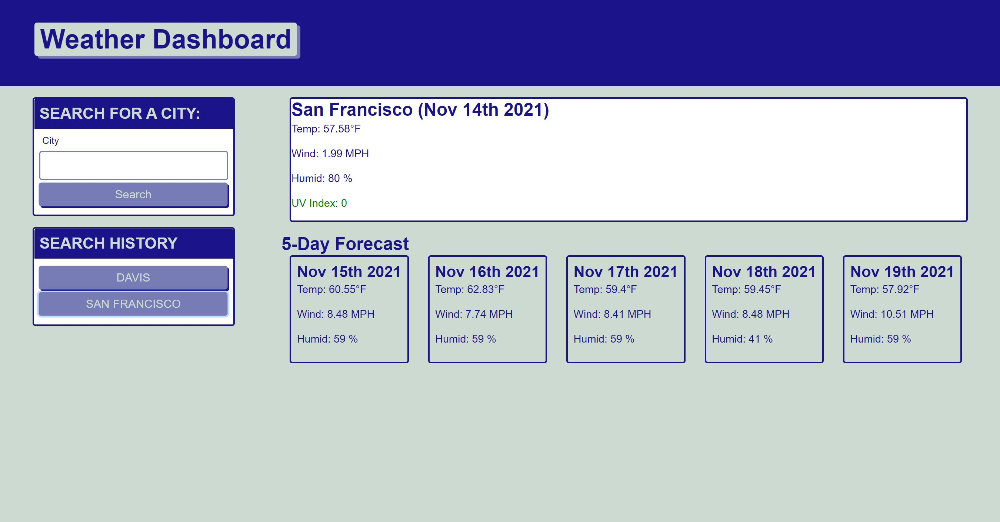

# Weather-Dashboard

Weather Dashboard will look up weather for city user search. It looks like the following:

Thw most difficult part is to know how to place each weather card on the page without duplicate. The innerHTML is a handy method. Next few days, I am going to change most of my code from using the append child to using innerHTML since it looks cleaner and easier to track any error. 

## Built With
* HTML
* CSS
* Javascript

## Website
https://maggie9685.github.io/Weather-Dashboard/

## License
Licensed under the MIT license.
